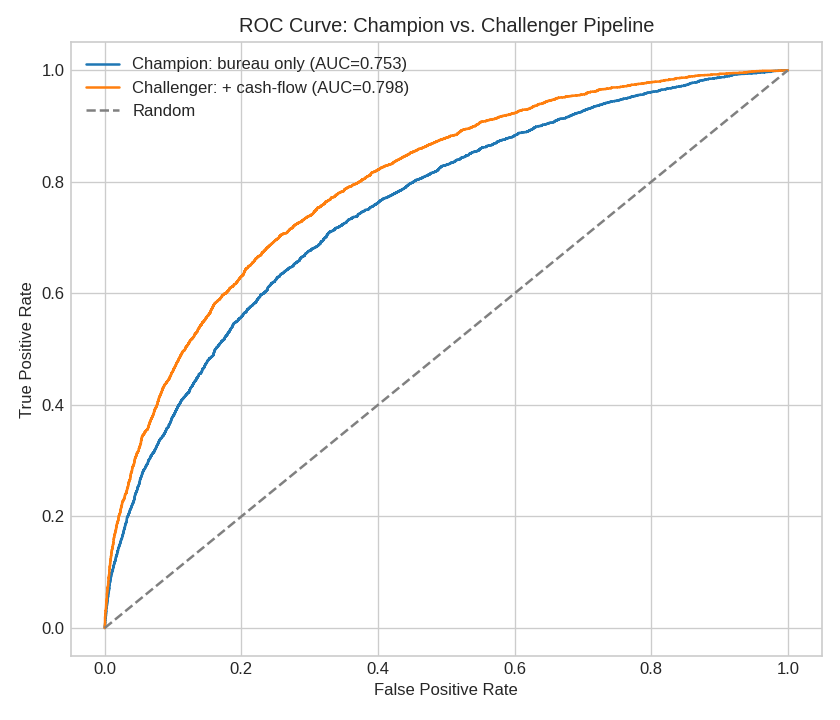
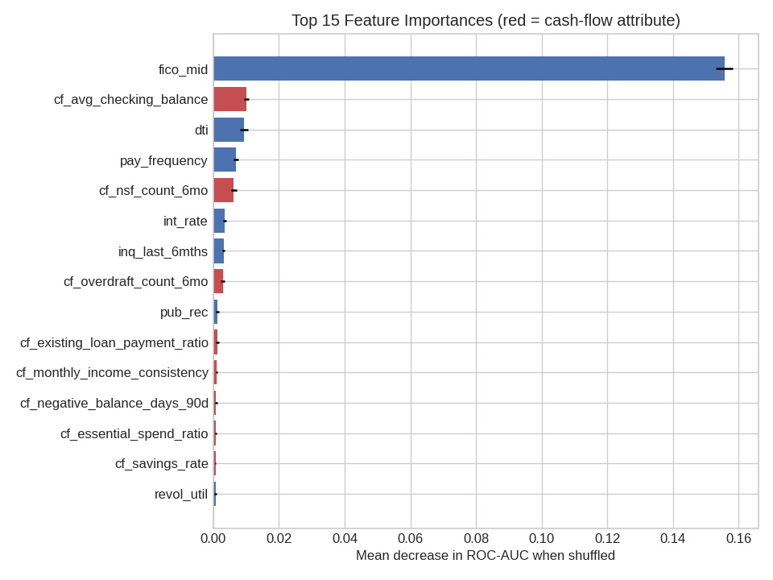

# Credit Risk Scorecard — A Real `sklearn.Pipeline` with LightGBM

A single, focused notebook demonstrating production-style credit risk scorecard
development: data cleaning, leakage-safe imputation, feature engineering, and
LightGBM modeling — all wired together as a genuine `sklearn.pipeline.Pipeline`
object, not loose sequential script code.

**Author:** Rishi Bavishi · [LinkedIn](https://www.linkedin.com/in/rishi-bavishi-25050845/) · rmbavishi22@gmail.com

---

## Why a real pipeline matters

Most "ML portfolio" notebooks show preprocessing and modeling as separate, sequential
script steps. That's fine for exploration, but it's not how this should be built for
production. This notebook instead wraps feature engineering, imputation, and categorical
encoding as actual **pipeline steps**, so that:

- The exact same fitted object can be called as `pipeline.predict_proba(new_application)`
  on a single brand-new raw application — no manual preprocessing step required at
  inference time
- There's zero risk of **training/serving skew** — a common real-world bug where feature
  logic used during training silently drifts from what's implemented in the serving code
- The whole thing — feature engineering, imputation, encoding, model — can be pickled,
  versioned, and deployed as one artifact

---

## ⚠️ A note on the data

This project uses a **hybrid synthetic dataset** (see [`data/generate_data.py`](data/generate_data.py)):

- **28 bureau / application features** are generated to match the schema, ranges, and
  statistical relationships of the real, publicly available **Lending Club** loan dataset
  ([Kaggle: wordsforthewise/lending-club](https://www.kaggle.com/datasets/wordsforthewise/lending-club)).
- **15 cash-flow / alternative-data features** (prefixed `cf_`) are fully synthetic. No public
  dataset contains real bank-transaction-level data — that's the proprietary territory products
  like Plaid operate in — so these are constructed to mirror the *kind* of signal that data
  provides, with a deliberately constructed underlying relationship to default risk.

No real, proprietary, or employer data is used anywhere in this repo.

---

## What's in this repo

| File | What it covers |
|---|---|
| [`notebooks/01_credit_risk_scorecard_pipeline.ipynb`](notebooks/01_credit_risk_scorecard_pipeline.ipynb) | The full pipeline: a custom `FeatureEngineer` transformer, `ColumnTransformer`-based imputation/encoding, a reusable pipeline-builder function, champion/challenger comparison (bureau-only vs. + cash-flow), ROC/AUC/KS evaluation, permutation feature importance, and a live demo scoring a single new application end-to-end |

---

## Sample results

| | |
|---|---|
|  |  |

Adding the 15 cash-flow attributes lifted the Gini coefficient from **0.506 to 0.596** (a
**+0.090** absolute lift), with cash-flow attributes accounting for roughly half of the
top 15 most predictive features.

---

## Why I built this

In my day-to-day work I build and validate ML-based credit decisioning models and evaluate
whether alternative data sources (e.g., cash-flow attributes) justify integration into
existing scorecards — quantified via Gini lift in a champion/challenger framework. This
notebook reconstructs that methodology on synthetic data, built the way it would actually
be deployed: as a single, reusable pipeline rather than disconnected preprocessing steps.

---

## Tech stack

- Python 3.10+
- pandas, numpy
- **LightGBM** (gradient boosting model)
- scikit-learn (`Pipeline`, `ColumnTransformer`, custom transformers, permutation importance, metrics)
- matplotlib

## Running locally

```bash
git clone https://github.com/<your-username>/credit-risk-scorecard-pipeline.git
cd credit-risk-scorecard-pipeline
pip install -r requirements.txt
python data/generate_data.py        # regenerate the synthetic dataset
jupyter notebook notebooks/          # open and run the notebook
```

---

## Background

10+ years of experience across consumer lending, risk analytics, and operations — currently
Principal, Risk and Analytics at Upbound Group. Recent work includes a retrospective credit
strategy analysis using alternative cash-flow data that quantified $15.8M in profit from
standalone model retraining plus an additional $7.7M in projected incremental profit from
combining alternative data with an existing scorecard.
